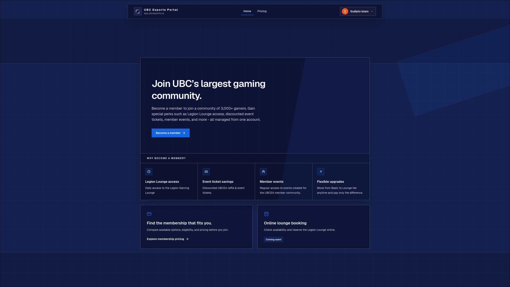
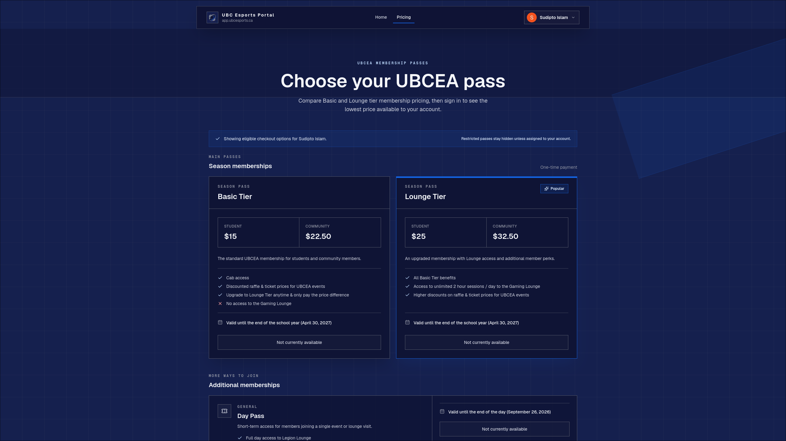
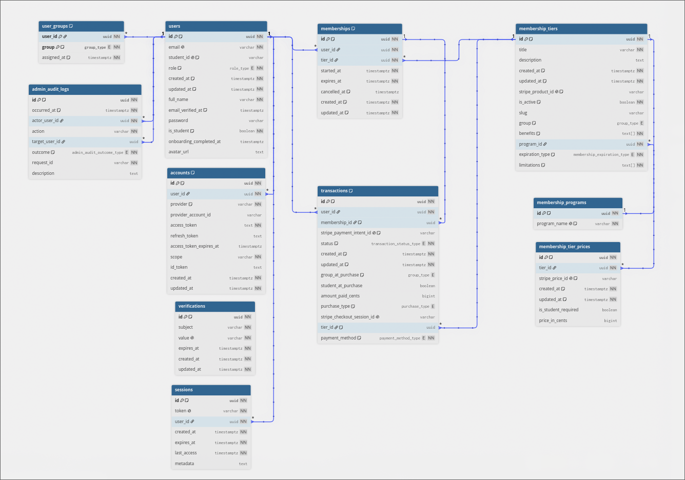

# UBCEA Portal

Welcome to the repository for the **UBCEA Portal**! We're building one place where members can compare and purchase memberships, check which passes are active, and look back at their membership history. It also gives admins an easier way to manage users, groups, profiles, memberships, and purchases.

We'll keep adding new UBCEA features here over time. The goal is to bring our member, event, team, and other club data together instead of spreading it across a bunch of different tools.

**Live application:** [app.ubcesports.ca](https://app.ubcesports.ca)

| Home page                                                    | Pricing page                                                       |
| ------------------------------------------------------------ | ------------------------------------------------------------------ |
|  |  |

## The tech stack

| Area         | Technology                                       | Responsibility                                                                       |
| ------------ | ------------------------------------------------ | ------------------------------------------------------------------------------------ |
| Web app      | Next.js 16, React 19, TypeScript, Tailwind CSS 4 | Public marketing pages, onboarding, checkout, member accounts, and admin tools       |
| API          | Go 1.26, Chi, Fx                                 | Authentication boundaries, business workflows, membership policy, and HTTP endpoints |
| Data         | PostgreSQL 17, pgx, sqlc, Goose                  | Profiles, tiers, memberships, transactions, sessions, and audit logs                 |
| Integrations | Zetrova, Stripe, Resend                          | OAuth identity, payment processing, and transactional email                          |
| Operations   | Docker, GitHub Actions, GHCR, Grafana Alloy      | CI, image delivery, VPS deployment, and centralized logs                             |

## Frontend context

The frontend lives in [`frontend/`](frontend) and uses the Next.js App Router. Routes fall into four broad groups:

- **Public:** landing, pricing, legal, login, and checkout result pages.
- **Onboarding:** profile completion and redirect checks after the first OAuth sign-in.
- **Member:** account details plus active and historical memberships.
- **Admin:** user search/filtering, CSV exports, profile and membership management, and audit logs.

| Area          | Convention                                                                                                                                   |
| ------------- | -------------------------------------------------------------------------------------------------------------------------------------------- |
| Server state  | Use TanStack Query for fetching, caching, and synchronizing API data.                                                                        |
| API client    | Use the shared Axios client in `frontend/src/lib/client.ts` for cookies, API errors, and authentication or onboarding redirects.             |
| Shared code   | Keep reusable UI in `frontend/src/components` and API hooks and shared types in `frontend/src/lib`.                                          |
| Styling       | Use the semantic brand tokens in `frontend/src/app/globals.css` and follow [`frontend/DESIGN_GUIDELINES.md`](frontend/DESIGN_GUIDELINES.md). |
| User feedback | Use shared components for repeated interactions and the configured Sonner toaster for user-facing async failures.                            |

## Backend context

The backend lives in [`backend/`](backend) and is composed with Uber Fx. Requests generally move through this path:

```text
router and middleware -> handler -> service / membership policy -> repository -> PostgreSQL
```

The main packages under `backend/internal` are:

| Package            | Role                                                                      |
| ------------------ | ------------------------------------------------------------------------- |
| `server`           | Chi routes, CORS, request IDs, logging, recovery, and server lifecycle    |
| `auth`             | Limen session integration, Zetrova OAuth, and authorization middleware    |
| `handlers`         | HTTP input/output and status mapping                                      |
| `service`          | Membership, profile, health, and admin use cases                          |
| `membershippolicy` | Eligibility, tier transitions, personalized pricing, and expiration rules |
| `repository`       | Database operations over generated sqlc queries                           |
| `stripeclient`     | Checkout creation, lookup, and expiration                                 |
| `mailer`           | Resend-backed transactional email                                         |
| `scheduler`        | In-process daily expiration reminders in `America/Vancouver`              |

Membership eligibility is deliberately centralized. It combines the member's student status and groups, the requested program, their current active membership, the purchase window, and allowed tier transitions. This keeps the API, Stripe flow, and admin-created offline purchases on the same rules.

## Database context

The current database consists of these main parts:

| Area                     | Main tables                                                         | Purpose                                                                                                                                                                                      |
| ------------------------ | ------------------------------------------------------------------- | -------------------------------------------------------------------------------------------------------------------------------------------------------------------------------------------- |
| Users and authentication | `users`, `accounts`, `sessions`, `verifications`                    | Stores member profiles, linked OAuth accounts, sessions, and verification records. These are all tables required by [Limen](https://limenauth.dev/), the authentication library that we use. |
| Access groups            | `user_groups`                                                       | Assigns members to groups such as competitive teams and executives. Needed for RBAC and eligible memberships.                                                                                |
| Membership catalog       | `membership_programs`, `membership_tiers`, `membership_tier_prices` | Defines programs, available tiers, eligibility requirements, benefits, limitations, expiration rules, and prices.                                                                            |
| Memberships and payments | `memberships`, `transactions`                                       | Records purchased access, active periods, cancellations, checkout state, payment methods, and amounts paid.                                                                                  |
| Administration           | `admin_audit_logs`                                                  | Provides an audit trail for successful, failed, and denied administrative actions.                                                                                                           |

Database changes are handwritten Goose migrations in `backend/sql/migrations`. Queries in `backend/sql/queries` are compiled into type-safe Go code in `backend/internal/database/db` by sqlc. Do not edit generated files directly.

This is the current database laid out in a visual format. If you want to look more into it, you can find it in this [dbdiagram.io](https://dbdiagram.io/d/UBCEA-Portal-6a2063d75863c1743479f161) file.



## Local development

### Prerequisites

- Go 1.26+
- Node.js 24+ and npm
- Docker with Docker Compose
- [Goose](https://github.com/pressly/goose) for migrations
- [sqlc](https://sqlc.dev) when changing SQL queries
- [Stripe CLI](https://docs.stripe.com/stripe-cli) for local checkout/webhook testing
- [Make](https://www.gnu.org/software/make/) for running dev commands easily
- Zetrova, Stripe, and Resend development credentials from a project maintainer

### 1. Install dependencies

```bash
cd frontend
npm ci
cd ../backend
go mod download
cd ..
```

### 2. Configure the apps

```bash
cp backend/.env.example backend/.env
cp frontend/.env.local.example frontend/.env.local
```

For the default local database, set these values in `backend/.env`:

```dotenv
POSTGRES_USER=dev
POSTGRES_PASSWORD=dev
POSTGRES_DB=ubcea
```

You will also need valid values for the following backend integrations. The API initializes its payment and mail clients at startup, so blank Stripe or Resend settings will prevent it from starting.

| Setting                                                        | Purpose                                                                | Where to get it                                                                                                                     |
| -------------------------------------------------------------- | ---------------------------------------------------------------------- | ----------------------------------------------------------------------------------------------------------------------------------- |
| `OAUTH_CLIENT_ID`, `OAUTH_CLIENT_SECRET`, `OAUTH_CALLBACK_URL` | Zetrova OAuth client and callback                                      | Ask a project maintainer for development credentials. The callback url is already in [backend/.env.example](./backend/.env.example) |
| `LIMEN_SECRET`                                                 | Session and authentication signing secret                              | Generate a unique random secret for local development, such as with `openssl rand -hex 32`.                                         |
| `STRIPE_SECRET_KEY`                                            | Stripe API access                                                      | Ask a project maintainer to give you access to the sandbox.                                                                         |
| `STRIPE_WEBHOOK_SECRET`                                        | Signature verification for forwarded webhook events                    | Run `stripe listen --forward-to localhost:8080/webhooks/stripe`; the Stripe CLI prints a local webhook signing secret.              |
| `STRIPE_CHECKOUT_SUCCESS_URL`, `STRIPE_CHECKOUT_CANCEL_URL`    | Return destinations after checkout                                     | Use the local frontend checkout URLs already provided in [backend/.env.example](./backend/.env.example).                            |
| `RESEND_API_KEY`, `SENDER_EMAIL`                               | Expiration notification email                                          | Ask a project maintainer for development values.            |
| `EXEC_ONBOARDING_CODE`                                         | Optional invite code used to assign executive access during onboarding | No need for this for development.                                                                                                   |

The frontend defaults to ports `3000` and backend to `8080`.

### 3. Set up the database

First run the database:

```bash
make db
```

Then migrate to the latest version and seed the database:

```bash
make migration-up
make seed file=membership_tiers_staging.sql
```

### 4. Run the stack

If you want to run everything docker, you can do the following command. This will start up the backend, frontend, database, and stripe webhook:

```bash
make docker
```

If you want to start them up separately (eg. you are just making frontend changes and want to see them instantly instead of having to restart docker), you can use these commands in seperate terminals:

```bash
make be
```

```bash
make fe
```

```bash
make stripe-webhook
```

Or you can run them all using this command, which will start up the frontend, backend, and stripe webhook. The database will be needed to be started separately, as shown in the last step.

```bash
make dev
```

Then open [http://localhost:3000](http://localhost:3000). The API health endpoint is [http://localhost:8080/health](http://localhost:8080/health).

## Development commands

| Command                               | What it does                                                |
| ------------------------------------- | ----------------------------------------------------------- |
| `make fe`                             | Start the Next.js development server                        |
| `make be`                             | Start the Go API                                            |
| `make db`                             | Start up the database                                       |
| `make dev`                            | Start up the backend, frontend, and stripe webhook together |
| `make docker`                         | Start up all services in docker containers                  |
| `make build-fe`                       | Create a production frontend build                          |
| `make build-be`                       | Compile the API to `backend/bin/api`                        |
| `make sqlc`                           | Regenerate Go database code after query/schema changes      |
| `make migration-new name=add_feature` | Create a timestamped SQL migration                          |
| `make migration-up`                   | Apply pending migrations                                    |
| `make migration-down`                 | Roll back one migration                                     |
| `make seed file=membership_tiers.sql` | Run a named seed from `backend/sql/seeds`                   |

### Changing the database schema

Create a new migration instead of editing one that may already be deployed:

```bash
make migration-new name=describe_the_change
```

Update affected sqlc queries, regenerate them, and test both a clean migration and the application's relevant workflows. Production runs all pending migrations before replacing the backend.

## Production context

Production runs on a VPS with Docker Compose. Every merge to `main` follows this path:

1. The **CI** workflow checks Go formatting and vet, runs backend tests/builds, lints and formats the frontend, and creates a production Next.js build.
2. After CI succeeds, **CD** builds minimal non-root backend and frontend images.
3. Images are pushed to GitHub Container Registry with both the commit SHA and `latest` tags.
4. The workflow copies the current Compose template to the VPS and injects the immutable SHA-tagged images.
5. PostgreSQL is health-checked and a one-shot migration container applies pending Goose migrations.
6. The backend and frontend start only after the database and migrations are ready.

The production Compose stack contains PostgreSQL with persistent host storage, the migration job, the Go API, the standalone Next.js server, and Grafana Alloy. Backend container logs are rotated locally and Alloy forwards opted-in service logs to Grafana Cloud. The Alloy HTTP endpoint is bound to loopback only.

Important operational details:

- `NEXT_PUBLIC_API_URL` and `NEXT_PUBLIC_SITE_URL` are baked into the frontend image during the build.
- `API_INTERNAL_URL=http://backend:8080` lets server-rendered frontend requests stay on the private Compose network.
- The API accepts credentialed browser requests only from trusted values in `FRONTEND_URL` (plus local development origins).
- PostgreSQL data lives in `<deploy path>/data`; normal container replacement does not remove it.
- Deployments currently use `docker compose down` followed by `up`, so a short interruption is expected.
- The daily expiration-email job runs inside the single backend process at 09:00 Vancouver time.

### One-time VPS setup

1. Install Docker and Docker Compose.
2. Create a deploy directory; its absolute path becomes `VPS_DEPLOY_PATH`.
3. Copy [`deploy/.env.example`](deploy/.env.example) to `.env` in that directory, add the backend integration settings from [`backend/.env.example`](backend/.env.example), and supply production values.
4. Copy `deploy/alloy/config.alloy` into `<deploy path>/alloy/config.alloy`.
5. Log in to GHCR with an account that can pull the repository's packages.
6. Add the deployment SSH public key to the deploy user's `~/.ssh/authorized_keys`.

```bash
echo <GITHUB_PAT> | docker login ghcr.io -u <GITHUB_USERNAME> --password-stdin
```

### GitHub Actions configuration

Repository secrets:

| Secret            | Description                               |
| ----------------- | ----------------------------------------- |
| `VPS_SSH_KEY`     | Private SSH key used by CD                |
| `VPS_HOST`        | VPS hostname or IP address                |
| `VPS_USER`        | SSH deployment user                       |
| `VPS_DEPLOY_PATH` | Absolute server-side deployment directory |

Repository variables:

| Variable               | Description                                              |
| ---------------------- | -------------------------------------------------------- |
| `NEXT_PUBLIC_API_URL`  | Browser-visible production API URL                       |
| `NEXT_PUBLIC_SITE_URL` | Canonical frontend URL for metadata, robots, and sitemap |

CD runs automatically after a successful `main` CI run and can also be started manually with the **CD** workflow's `workflow_dispatch` action.